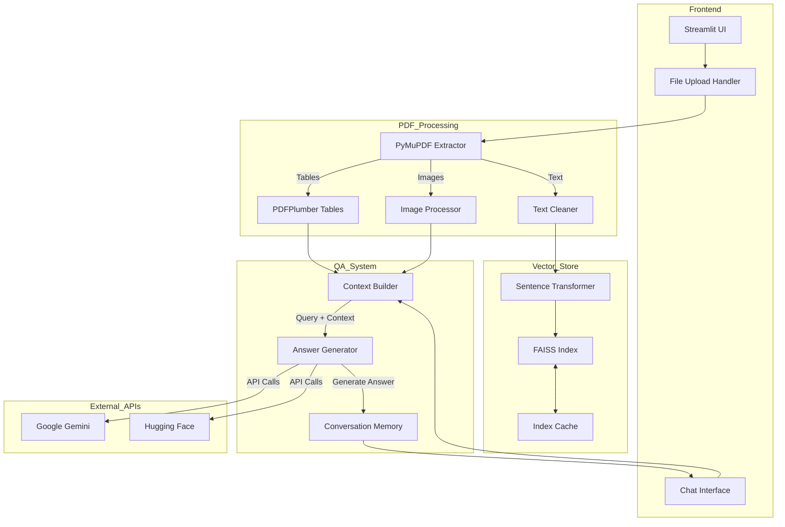
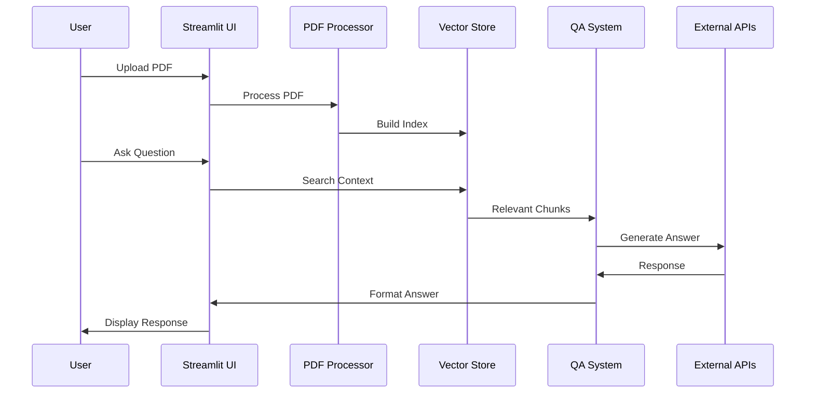

# ArxivLensAI Technical Report

## Overview
ArxivLensAI is an AI-powered personal research assistant that transforms research papers into an interactive Q&A system. It allows users to upload research papers (PDFs), extract and process their content (including text, tables, and images), build a semantic search index using FAISS, and interact with the document through a chatbot interface powered by advanced AI models.

## Detailed System Architecture

### Component Diagram


### Data Flow Architecture


### Component Details

#### 1. Frontend Layer
- **Streamlit UI (`app.py`)**
  ```python
  class StreamlitUI:
      def __init__(self):
          self.session_state = {}
          self.chat_history = []
          self.selected_papers = []

      def handle_file_upload(self, file):
          # Process uploaded PDF
          pass

      def display_chat(self):
          # Render chat interface
          pass
  ```

#### 2. PDF Processing Layer
- **Text Extraction (`extract_text.py`)**
  ```python
  class PDFProcessor:
      def __init__(self):
          self.fitz_doc = None
          self.plumber_doc = None

      def extract_content(self):
          # Extract text, tables, images
          pass

      def clean_text(self):
          # Clean and normalize text
          pass
  ```

#### 3. Vector Store Layer
- **FAISS Integration (`vector_store.py`)**
  ```python
  class VectorStore:
      def __init__(self):
          self.index = None
          self.embeddings = None
          self.chunks = []

      def build_index(self):
          # Create FAISS index
          pass

      def search(self, query):
          # Semantic search
          pass
  ```

#### 4. QA System Layer
- **Answer Generation (`qa_system.py`)**
  ```python
  class QASystem:
      def __init__(self):
          self.models = {}
          self.memory = []

      def generate_answer(self):
          # Generate research answer
          pass

      def manage_context(self):
          # Handle context window
          pass
  ```

### System Workflow

1. **PDF Upload & Processing**
   ```mermaid
   graph LR
       A[Upload PDF] --> B[Extract Content]
       B --> C[Clean Text]
       C --> D[Build Index]
       D --> E[Cache Index]
   ```

2. **Query Processing**
   ```mermaid
   graph LR
       A[User Query] --> B[Search Index]
       B --> C[Build Context]
       C --> D[Generate Answer]
       D --> E[Update Memory]
   ```

### Implementation Details

#### 1. File Structure
```
ArxivLensAI/
├── app.py                 # Main Streamlit application
├── extract_text.py        # PDF processing
├── vector_store.py        # FAISS operations
├── qa_system.py          # Answer generation
├── utils.py              # Helper functions
└── static/               # Static assets
```

#### 2. Key Classes and Methods
```python
# Core functionality mapping
COMPONENTS = {
    'UI': 'StreamlitUI',
    'PDF': 'PDFProcessor',
    'Vector': 'VectorStore',
    'QA': 'QASystem'
}

# Inter-component communication
class MessageBus:
    def __init__(self):
        self.handlers = {}

    def publish(self, event, data):
        pass

    def subscribe(self, event, handler):
        pass
```

### Performance Considerations

1. **Memory Management**
   ```python
   class MemoryManager:
       def __init__(self):
           self.cache = {}
           self.index_store = {}

       def cleanup(self):
           # Remove old indices
           pass
   ```

2. **Optimization Techniques**
   - Chunk size: 512 tokens
   - FAISS parameters:
     - nlist: 100
     - nprobe: 10
   - Caching strategy:
     - Index lifetime: 24 hours
     - Memory threshold: 80%

### Security Architecture

1. **API Key Management**
   ```python
   class KeyManager:
       def __init__(self):
           self.keys = {}

       def rotate_keys(self):
           # Implement key rotation
           pass
   ```

2. **Data Protection**
   - Temporary file cleanup
   - Secure API key storage
   - Rate limiting

## System Requirements

### Hardware Requirements
- CPU: 4+ cores
- RAM: 8GB minimum
- Storage: 10GB+ for index storage

### Software Dependencies
```python
requirements = {
    'streamlit': '>=1.24.0',
    'PyMuPDF': '>=1.22.0',
    'pdfplumber': '>=0.10.0',
    'faiss-cpu': '>=1.7.0',
    'sentence-transformers': '>=2.2.0',
    'google-generativeai': '>=0.3.0',
    'transformers': '>=4.30.0'
}
```


## Conclusion
ArxivLensAI demonstrates a robust architecture that effectively combines modern AI technologies with practical research tools. The system's modular design ensures maintainability and extensibility, while its optimized performance makes it suitable for both local and cloud deployment.
